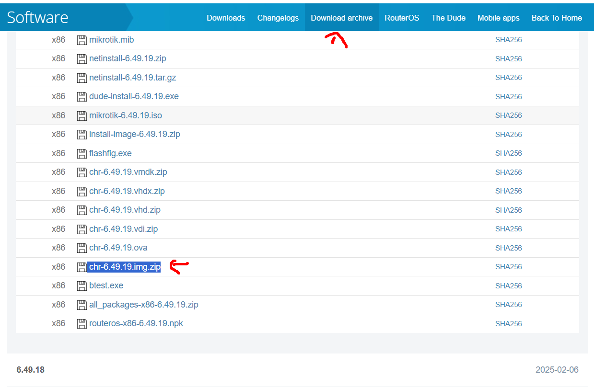

# pnet lab
## requirement
- [ova pnet lab](https://pnetlab.com/pages/download)
- [mikrotik_official](https://mikrotik.com/download)
  
  <!-- - Pilih X86 → Main package → Install image -->
  - pilih chr yang zip

## setup
### vm
- import > click file ova yang sudah di downdload dan sesuaikan
- setelah terbuat vmnya jan lupa ubah settingan network adapter 2 menjadi Bridge adaptor dengan promiscous mode: **Allow All**
- default login terminal adalah root:pnet
- default login web adalah admin:pnet, jangan lupa default console nya diubah menjadi html console

### hosted
comming soon

# append os / router
## manual
### os
- [pnet image](https://drive.google.com/drive/folders/1BzWFVzaCqOXvyFTVFMiKQAVKng-EtC-o?usp=sharing)
- [pnetlab add mikrotik](https://gratisfreeware.wordpress.com/2025/01/06/menambahkan-mikrotik-ke-pnet-lab/)

### tutorial
```bash
scp router.img root@<ip>/opt/unetlab/addons/qemu/<nama>
# nama nya harus strip jan andescore misal ini mikrotik-6.49.18

# /opt/unetlab/wrappers/iol_wrapper -a permissions
/opt/unetlab/wrappers/unl_wrapper -a fixpermissions

# bisa juga pake yang di web ada di system > system setting, fix permission
```

## automatic
- [ishare2](https://github.com/pnetlabrepo/ishare2)

### by aria
```bash
# wget -O - https://raw.githubusercontent.com/ariafatah0711/net_aria/refs/heads/main/pnetlab/setup.sh | bash
wget -o https://raw.githubusercontent.com/ariafatah0711/net_aria/refs/heads/main/pnetlab/mikrotik.sh /usr/bin/mikrotik
```

### by ishare 2
```bash
wget -O /usr/sbin/ishare2 https://raw.githubusercontent.com/pnetlabrepo/ishare2/main/ishare2 > /dev/null 2>&1 && chmod +x /usr/sbin/ishare2 && ishare2

ishare2 search all
ishare2 search bin
ishare2 search qemu
ishare2 search dynamips

ishare2 search mikrotik # mikrotik
ishare2 search vios # cisco
ishare2 search forti # fortigate
ishare2 search juniper # juniper  
# ishare2 search win-
# ishare2 search winserver
# ishare2 search kali
# ishare2 search mikro
# ishare2 search nxos
# ishare2 search vmx
# ishare2 search esxi
# ishare2 search palo
# ishare2 search Licensed

ishare2 pull bin <number>
ishare2 pull qemu <number>
ishare2 pull dynamips <number>

ishare2 pull bin all
ishare2 pull qemu all (Not available for qemu type due to its large size)
ishare2 pull dynamips all

ishare2 installed all
ishare2 installed bin
ishare2 installed qemu
ishare2 installed dynamips
ishare2 installed docker
```

## tutorial
- [cisco_ospf multi area](https://masdiditaji.blogspot.com/2018/07/lab16-cara-konfigurasi-ospf-multiarea.html)
- [mikrotik_ospf virtual link](https://alfafarhans.blogspot.com/2017/11/lab-3-mikrotik-routing-ospf-virtual-link.html)
- [mikrotik_ospf nssa,  stub, stub no summary](https://masdiditaji.blogspot.com/2018/07/Cara-konfigurasi-OSPF-Multi-area-Fail-Over-Stub-Totaly-Stub-dan-NSSA-Mikrotik.html)
- [mikrotik_vlan](https://tutorialmikrotik.com/tutorial-konfigurasi-vlan-mikrotik/)
- [mikrotik IPSec](https://citraweb.com/artikel/372/#:~:text=Site-2%20menggunakan%20IP%20Publik%20IP%20172.16.1.2%20dan%20IP%20LAN%20192.168.2.0/24.)
- [nmba mikrotik](https://citraweb.com/artikel/320/#:~:text=Tidak%20cukup%20sampai%20disini,%20karena%20kita%20menggunakan%20Network%20Type%20NBMA)
- [route rules](https://citraweb.com/artikel_lihat.php?id=351#:~:text=Langkah%20pertama%20kita%20perlu%20melakukan%20%22Basic-Config%22%20pada%20Router,%20kita%20bisa)
- [dhcp options list](https://help.mikrotik.com/docs/display/ROS/DHCP)
- [dhcp option list 2](https://www.iana.org/assignments/bootp-dhcp-parameters/bootp-dhcp-parameters.xhtml)
- [dynamic queue](https://buananetpbun.github.io/mikrotik/Auto-Simple-Queue-From-DHCP-Server.html)
- [vlan stacking](https://mikrotik.co.id/artikel_lihat.php?id=418)